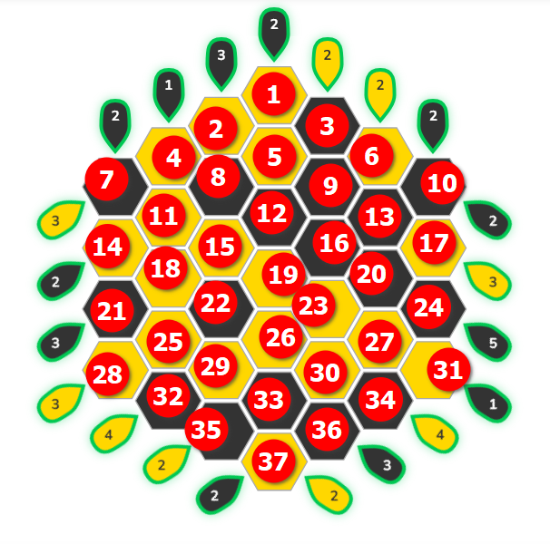

# Buzzled Master Solver

A program to generate all the valid solutions to the master version of the [Buzzled](https://puzzmallow.com/buzzled) game.

## How To's

This has been tested under WSL and it works. If you want to use the plotting using

### How To Run the Solver
Under linux build the program for your system using `./build.sh`. Then run `./solve`.

### How To Plot the Results
To plot your results, copy the results into plot solutions. To get this to run you'll need to install
python and install the requirement in the requirements.txt: `pip install -r "requirements.txt"`.
You can then run this. If running it under WSL, you'll need to

## How Does it Work - Brute Force Solver

Every possible board state is represented using 37 bits, where each tile maps to one bit.
If the bit is one, the tile is yellow, and black when it is zero. To check if a solution is valid,
for each row we bitwise and the board state "precomputed" bit mask and then we count the number of
yellow tiles using the `std::popcount` function introduced in C++ 20 (hopefully this compiles down
to the single `POPCNT` x86 instruction). We compare this for the target for the row and if it
matches we move onto the next row, if it fails, we move onto the next board state as it can't be
valid.

We check all the board values in sequence starting at the first board state with the right number
of yellow tiles and terminating at the last board state with enough black tiles. We only check boards
with the right number of yellow tiles. We run several threads in parallel to reduce the total
execution time.

The index used (from 1 as that what my annotation software generates) is shown below. The red arrows
indicate the direction in which the bitmasks are recorded.

## How Does it Work - Deterministic Solver

Every possible board state is represented using 37 bits, where each tile maps to one bit.
If the bit is one, the tile is yellow, and black when it is zero. To solve the board we
first look at all rows seeing whether any row trivially meets its constraints (i.e. all yellow
or all black tiles). We then repeat this step seeing whether in our previous pass we allocated
all N required yellow or black tiles for that row. If we do an iteration where we haven't solved
any new rows but we still haven't allocated all the tiles, then there is more than one solution
and the deterministic solver gives up.

## How Does it Work - Auto Solver

Uses selenium to pull in the data directly from the website before chucking it into a C++ utility
which tries to solve it first with the deterministic solver, which if that fails it then generates
all the different solutions using the brute force solver. The script then automatically plots
all the different solutions.

## Future work

- ~~Parallelise the search~~
- ~~Further optimise the solution search?~~
- ~~Automate setting the parameters~~
- ~~Automate plotting solutions as they're generated~~
- Generalise to different sizes of puzzles
- Figure out a way of analytically predicting how many solutions there are
- ~~Build a tool to solve the mini, classix, and expert puzzles~~.
- Build a clone to add a depth 5 puzzle

## Auto Solve - Extra installton steps

- Install firefox, preferably not via snap. See [here](https://askubuntu.com/questions/1399383/how-to-install-firefox-as-a-traditional-deb-package-without-snap-in-ubuntu-22).
- Setup XDG variabls as per [this stack overflow post](https://askubuntu.com/questions/456689/error-xdg-runtime-dir-not-set-in-the-environment-when-attempting-to-run-naut).
- Install selenium